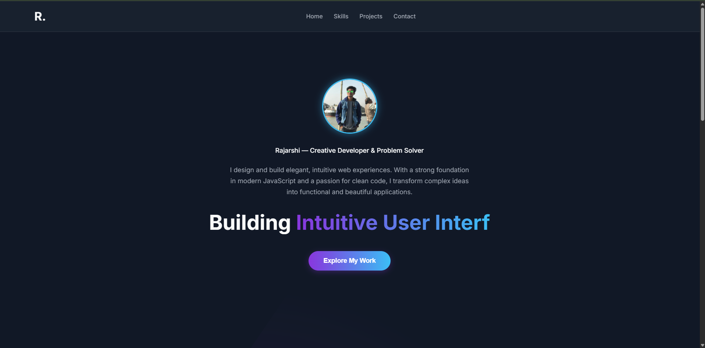

# Rajarshi's Dynamic Developer Portfolio

This repository contains the source code for my personal developer portfolio, a dynamic single-page application built from scratch to showcase my skills in frontend development using modern web technologies.

**[View the Live Demo Here!](https://rajarshi-2005.github.io/ApexPlanet/)**

---



## ✨ Features

-   **Modern & Dynamic UI:** A sophisticated dark theme with animated gradient backgrounds, glassmorphism effects, and scroll-triggered animations that make the site feel alive and professional.
-   **Single-Page Application (SPA) Feel:** Seamless navigation between the main portfolio and individual project views without any page reloads, built entirely with vanilla JavaScript.
-   **Interactive Project Showcases:** Includes two fully functional mini-applications to demonstrate practical coding skills:
    -   **To-Do List:** A sleek and modern task manager with full CRUD functionality that persists data in the browser's local storage.
    -   **Product Showcase:** An e-commerce style product page that dynamically renders data and features client-side filtering and sorting algorithms.
-   **Fully Responsive:** Meticulously designed to provide an optimal and consistent experience on all devices, from mobile phones to widescreen desktops.

## 🛠️ Tech Stack

This project was built using core web technologies to demonstrate a strong command of the fundamentals.

-   **HTML5:** For clean, semantic, and accessible page structure.
-   **CSS3:** For advanced styling, custom properties (variables), complex layouts (Flexbox & Grid), and modern effects like glassmorphism and keyframe animations.
-   **Vanilla JavaScript (ES6+):** For all interactivity, DOM manipulation, state management (view switching), and the logic for the embedded applications.

## 🚀 Getting Started

No complex setup is required. To run this project locally, simply clone the repository and open the `index.html` file in your browser.

```bash
# Clone this repository to your local machine
git clone [https://github.com/Rajarshi-2005/Rajarshi-2005.github.io.git](https://github.com/Rajarshi-2005/Rajarshi-2005.github.io.git)

# Navigate into the project directory
cd Rajarshi-2005.github.io
